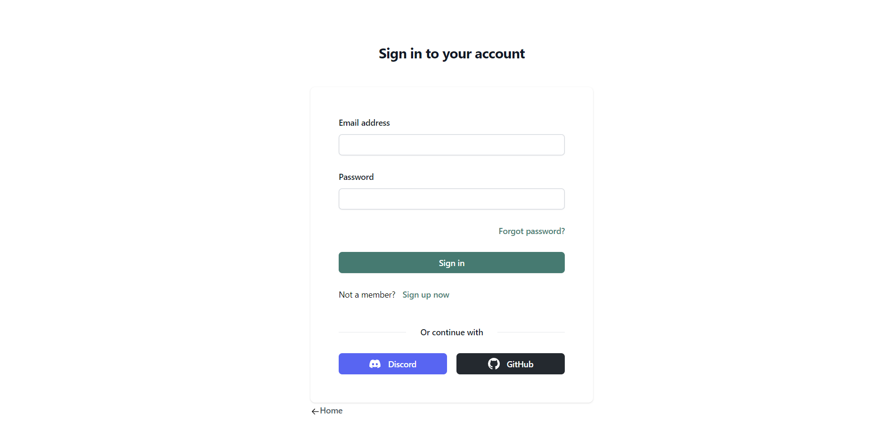
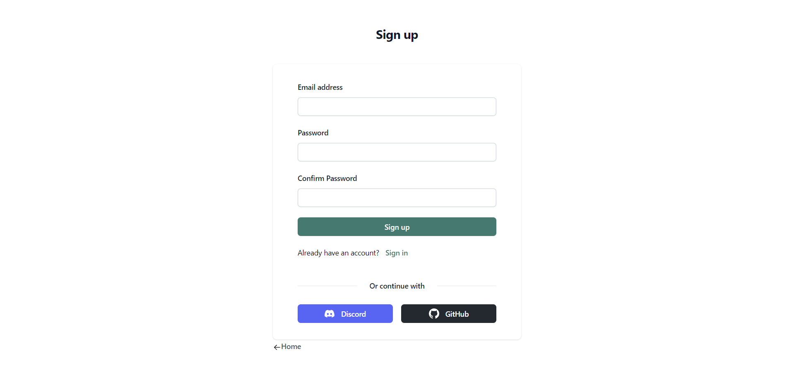
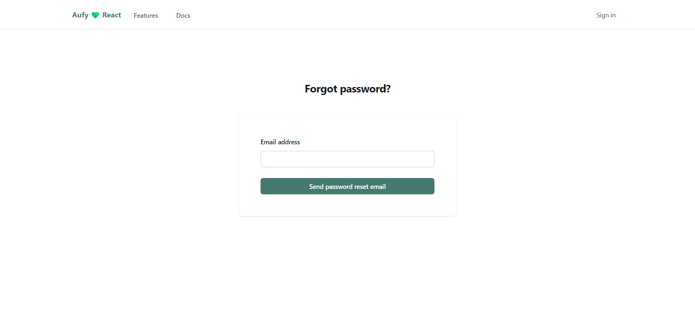
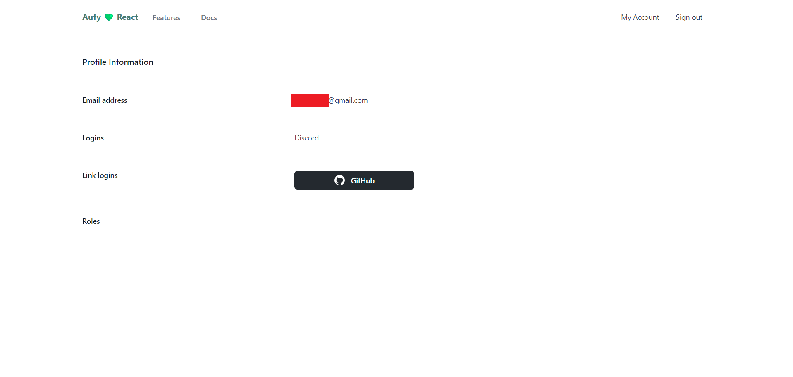
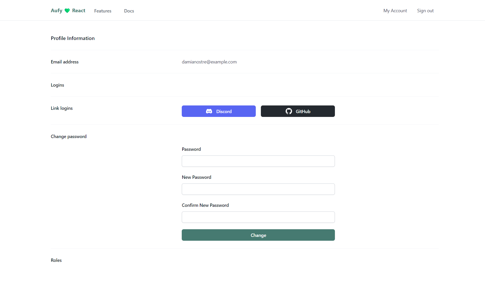

# Aufy

<p align="center">
  
</p>


<p align="center">
  <strong>Simple, Open-Source User Authentication for ASP.NET Core</strong>
</p>

## 🚀 Features

- ✅ Ready-to-use API endpoints
- 🔐 JWT bearer authentication with refresh tokens
- 🌐 Social logins (Discord and GitHub configured in templates)
- 📧 Email/password sign up with confirmation
- 🔑 Password change and reset functionality
- 🖥️ Sample client applications - [Aufy starters](https://github.com/damianostre/aufy-starters)
  - React
  - Vue.js
  - Angular
- 📨 Email sending abstraction for confirmations and password resets
- 📬 FluentEmail integration with customizable templates
- 🛠️ Customizable sign-up endpoints
- 📚 OpenAPI/Swagger support with customization options

## 📖 Documentation

For detailed documentation and usage instructions, visit our official documentation site:

[https://aufy.dev](https://aufy.dev)

## 🚀 Quick Start

### Go to [Aufy starters](https://github.com/damianostre/aufy-starters) repository.

You can fork the repository or download the starter you want to use. Starter repository is a template repository, so you can create a new repository from it.
Find a `Use this template` button on the repository page and choose a `Create a new repository` option.


Follow the instructions to create a new repository on your GitHub account.

### Clone the repository

Clone the created repository to your local machine.

### Install the .NET SDK.

Make sure you have the .NET SDK 8.0 installed on your machine. You can download it from the [official website](https://dotnet.microsoft.com/download).

### Open the chosen ASP.NET Core solution in the editor of your choice.

Go to `src` directory and find the starter you want to use. Each starter has its own solution file `WebApp.[STARTER TYPE].sln`.

> [!CAUTION]
> `src/WebApi` directory contains multiple projects depending on the starter you choose.
> I recommend to remove all projects except the one you want to use.
>
> If you want to keep multiple projects, the `ef database` command needs to specify the project file.


If `src/WebApi` directory contains one project:

Open the command line in the `src/WebApi` folder and run the following command to create a new Sqlite database and apply migrations.

```bash
dotnet ef database update
```

If `src/WebApi` directory contains multiple projects:

Open the command line in the `src` folder and run the following command to create a new Sqlite database and apply migrations.

```bash
dotnet ef database update -p ./WebApi/WebApi.[STARTER TYPE].csproj -s ./WebApi/WebApi.[STARTER TYPE].csproj
```

If operation completed successfully, you should see the new `app.db`  file in the `src/WebApi` folder.

### Configure JWT Bearer authentication.

Open the `appsettings.json` file in the `src/WebApi` folder and configure the `JwtBearer` section.

```json title="appsettings.json"
  "Aufy": {
    "JwtBearer": {
      "SigningKey": "xxx",
      "Issuer": "[Your Issuer]",
      "Audience": "[Your Audience]",
    }
}
```
Change the Issuer and Audience values to your own.

Next, go to the `secret.json` that is already set in the `WebApi` project file. You can change the name, but it's not necessary.
From Visual Studio, right-click on the `WebApi` project and choose `Manage User Secrets`.


Provide a secret value for the `SigningKey` property, that will be used for signing JWT tokens on your local development environment.
```json title="secret.json
{
  "Aufy:JwtBearer:SigningKey": "[At lest 256 bits long key]"
}
```


> [!CAUTION]
> You should never commit the value of `SigningKey` to the repository. It should be kept secret.

More about managing secrets in ASP.NET Core can be found
[here](https://learn.microsoft.com/en-gb/aspnet/core/security/app-secrets?view=aspnetcore-8.0&tabs=windows)

### Configure dev certificates.

WebApi and Client projects are configured to use HTTPS. To run the application locally, you need to trust the development certificates.

#### Windows

For windows, you can run the following command in the command line to trust the development certificates.

```bash
dotnet dev-certs https --trust
```

This will allow to run the WebApi project with HTTPS.

The certificate for Client project will be automatically created when you run the project.

#### Linux

As linux doesn't support the --trust flag, you need to manually trust the development certificates for web browsers.

You can follow the instruction on the
[stackoverflow](https://stackoverflow.com/questions/72226270/valid-https-certificate-for-dotnet-development-on-localhost-ubuntu).
This will allow to run the WebApi project with HTTPS.

Unfortunately, the certificate for Client project will not be automatically created when you run the project.
For some reason it doesn't work out of the box like on Windows.

You can create it manually by running the following command:
    
```bash
dotnet dev-certs https --format pem -ep /home/[YOUR_LOCAL_USER_DIR]/.aspnet/https/aufy.client.pem --no-password
```


> [!IMPORTANT]
> At this point, you should have a working starter with email/password flow.
>Email confirmation is turned off. All emails are saved to the file system in the `Development` environment in the `src/WebApi/logs/emails` folder.
> 
> To enable social logins follow this documentation.

### Configure social logins.

Starters come with Discord and GitHub social logins pre-configured, but you need to provide your own client IDs and secrets.

TODO - tutorial on create Discord and GitHub apps.

Callback urls for Discord and GitHub are on localhost:
- Discord: `https://localhost:7050/api/auth/external/callback/discord`
- GitHub: `https://localhost:7050/api/auth/external/callback/github`

The `api/auth/` is default prefix for auth endpoints. If you change it, you should also change the callback urls.

Once you got your client IDs and secrets, open secrets.json file in the WebApi project and add the following configuration:

```json title="secret.json"
{
  "Aufy:Providers:GitHub:ClientId": "[Your GitHub client ID]",
  "Aufy:Providers:GitHub:ClientSecret": "[Your GitHub client secret]",
  
  "Aufy:Providers:Discord:ClientId": "[Your Discord client ID]",
  "Aufy:Providers:Discord:ClientSecret": "[Your Discord client secret]"
} 
```

### Run the WebApi project.

`WebApi` comes with two pre-configured launch profiles: 

* `WebApiWithClient` - runs the WebApi project and the Client project using SPA Proxy.
* `WebApi` - runs only the WebApi project. You need to run the Client project separately with `npm run dev` command.

## 📸 Aufy Starters Screenshots






